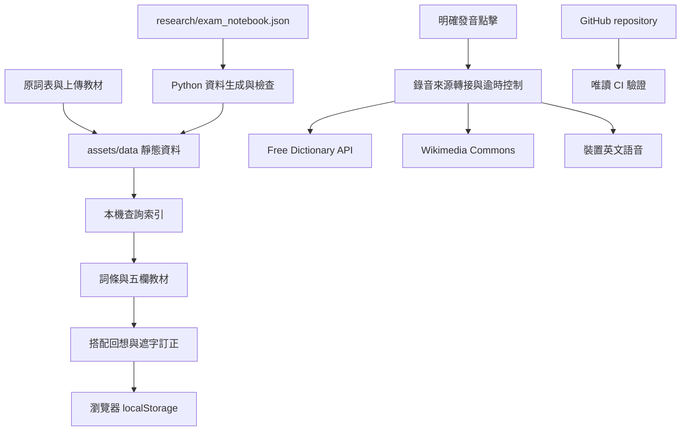

# 靜態學習網站架構

這個網站以 GitHub Pages 根目錄部署。瀏覽器本機執行查詢、教材呈現、練習與紀錄；GitHub Actions 驗證可部署檔案。工程參考資料與研究採用範圍見 [TECHNOLOGY_RESEARCH_2026.md](TECHNOLOGY_RESEARCH_2026.md)，教材維護步驟見 [CONTRIBUTING.md](../CONTRIBUTING.md)。

## 資料與相容性

`assets/data/vocabulary.js` 保有 6,012 個原詞條 ID；`builtin-study.js` 保存對應的原教材。`exam-notebook.js` 由可編輯 JSON 生成，提供情境字義、搭配、關聯、字族及自編例句。`exam-notes.js` 將筆記覆蓋於主要教學例句，同時把原教材存入 `EXAM_ORIGINAL_STUDY`。補充詞在執行時另行附加，不冒稱大考中心原詞表收錄。

詞性與多重字義欄直接顯示原 `entry.meaning` 的完整字串，以及原教材的 `plainMeaning` 簡要說明、存在的完整 `ankiMeaning`。`getOriginalStudy(entry) || study` 取得覆蓋前的教材，避免用新的摘要取代原說明；原簡要說明與原釋意完全相同時僅顯示一次。其後才列出新編的分詞性情境說明。保留原文不代表所有舊譯法都適合當代作文，少用／專門義仍需對照情境與字典。原例句和原搭配可展開備查。

`exam-evidence-index.js` 是小型年度索引，搜尋與年度篩選無需讀取所有引文。展開來源時才讀同站的 `exam-evidence.json`，並分別標示本文、題幹或選項。每個索引記錄來源檔案雜湊，生成器與驗證工具確認同步。

`kk-pronunciation.js` 保存由固定 CMUdict 版本轉寫的美式 KK 音段。音標轉寫與實際錄音來源各自標示；不把 CMUdict 文字音段稱為真人錄音。原 ECDICT 音標也保留。轉寫及重音位置限制見 [KK_NOTATION.md](KK_NOTATION.md)。

## 執行順序與查詢

HTML 使用本機 `defer` 腳本並依序載入：設定 → 靜態資料 → 筆記整合 → 狀態 → 內建教材工具 → 搜尋 → 例句及發音 → 搭配回想 → UI → 收藏、診斷與學習助手 → app 啟動。靜態驗證器保有完整預期順序；新增腳本須同步調整該清單。

搜尋欄位採 `WeakMap` 快取，保留英文單字、字族、中文釋意、搭配與情境文字。BM25 倒排清單只為命中 token 的文件計分，再與字面匹配、既有概念規則透過 reciprocal rank fusion 合併。英文字母拼寫近似使用三列、有距離界限的編輯距離計算，保留相鄰字母交換行為。

閒置建立索引每段以約 4 ms 為預算，至少處理一個詞條；瀏覽器提供 idle callback 時使用其剩餘時間。使用者在索引完成前查詢，仍會同步補齊索引，因此首次查詢成本不可宣稱完全消除。字面及概念比對也仍遍歷詞條；這是目前約六千詞規模下的取捨。量測工具提供無查詢結果快取的 median／p95、索引時間與堆積記憶體，測試確保排序相容；測量結果與限制見 [SEARCH_PERFORMANCE.md](SEARCH_PERFORMANCE.md)。

## 發音與故障控制

`audio.js` 在使用者點擊後，依選擇查詢 Free Dictionary API 或 Wikimedia Commons；自動模式按順序使用來源，失敗後回到裝置英文語音。提供口音與來源選擇，並只儲存偏好。錄音使用 HTTPS 來源白名單，附可取得的出處／授權；若口音缺少可靠標記則明說未標示。

查詢與播放各有逾時，整體錄音嘗試有總預算、來源數與次數限制。切詞／停止採會話識別與取消，避免舊查詢晚回覆覆蓋新狀態。錄音 metadata 使用有上限的記憶體快取，播放失敗可在下次明確點擊重查；不預取整份詞表、不自動下載音訊或模型。

只有 `localService === true` 的已安裝英文聲線用於裝置備援；未安裝所選口音時顯示實際聲線。例句保持裝置朗讀，不發送完整例句至錄音供應商。詳見 [PRONUNCIATION_SOURCES.md](PRONUNCIATION_SOURCES.md)。

## 練習與瀏覽器紀錄

搭配回想先提示中文，暫時收起可能暴露答案的教材，再顯示完整英文搭配供自評。答不出來先訂正，之後再回想；完成後由使用者把詞加入現有複習清單。保留鍵盤焦點、Esc 返回、手機排版及失敗儲存提示，不用自評推定學習者已長期記住。互動與儲存範圍見 [RETRIEVAL_PRACTICE.md](RETRIEVAL_PRACTICE.md)。

舊收藏 `gsat-standalone-favorites-v1`、舊複習 `gsat-v3-review-queue-v1` 保持不變。遮字練習使用來源與完整句子作識別，搭配回想使用詞、搭配與譯義作識別；更新教材不借用舊內容的作答結果。搭配進度使用獨立的 `gsat-notebook-retrieval-v1`，限制記錄數及大小，檢查輸入資料並容忍儲存失敗。

複習沿用已有規則時程，並未訓練個人遺忘曲線、估計記憶機率或實作 FSRS 模型。研究支持的回想、訂正與隔時練習只作為互動設計依據，不能據此宣稱本網站已有實驗證明提分。

## Repository 與驗證

根目錄是唯一維護和部署入口；`index .html` 與 `index.html` 完全一致，舊重複目錄入口導回根目錄。每個本機 HTML 素材 URL 使用 SHA-256 前 12 位作 `v` 參數，避免更新後仍使用舊快取。`tools/validate_site.py --refresh-hashes` 可一次更新兩個入口，並檢查檔案存在、專案相對路徑、manifest 圖示、腳本順序、原詞條 ID 及教材統計。

CI 的 `data-and-code` 工作驗證全部 Node 測試、Python 資料測試、生成結果及靜態素材。`browser` 工作以固定 Playwright／Chromium 測試桌面和手機尺寸、收藏相容、來源展開、回想流程，以及受控的音訊失敗備援。Actions 固定完整 commit SHA、唯讀 `contents` 權限、checkout 不留憑證、限時及重複執行取消；Dependabot 提出 Action／瀏覽器測試依賴更新供審查。

工作流程不自動提交資料、不部署、不改動 Pages 設定。本次從已取得原文的 GitHub Well-Architected 與 System Design Primer 採用資料責任分離、驗證、延遲量測和快取取捨。指定的 GitHub agent-scale Git 文章未取得全文，不能聲稱實作了其中的內部 Git 技術；存取紀錄見研究文件。新增大量資料或複雜功能前應重新量測載入、查詢及可存取性需求。
